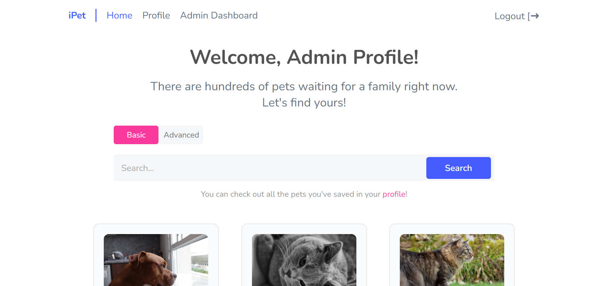

In development...

<!-- Deployed link: https://tweet-out.web.app -->

# Pet Adoption Project

A pet-adoption web platform, where users can sign up, search and adopt pets. This repository only contains back-end part of the project.

## Table of contents

- [Overview](#overview)
  - [The challenge](#the-challenge)
  - [Screenshots](#screenshots)
  - [Links](#links)
- [My process](#my-process)
  - [Built with](#built-with)
  - [What I learned](#what-i-learned)
- [Author](#author)
- [Acknowledgments](#acknowledgments)

## Overview

### The challenge

From the back-end users should be able to: (some routes are protected to users only using token)

- Sign up and login 
- View the list of all pets 
- View a pet card to see the full information
- Adopt, foster or save the pet for later 
- View and change their profile info in the Profile component, toggle between the pets they own or have saved

From the back-end admins should be able to: (all routes are protected to admins only)

- View lists of users and pets on the dashboard 
- View each user and their info (name, email, pets they own or foster)
- View each pet profile and be able to change it
- Be able to add a new pet

### Screenshots

<!-- ### Links

- Live Site URL: [tweet-out.web.app](https://tweet-out.web.app) -->

## My process

### Built with

- Node.js
- MySql

### What I learned
In this project I learned:
- how to use Node.js
- how to create and connect to server and MySQL database
- how to write end points
- how to validate requests
- how to protect routes
- how to authenticate users with token
- how to "CROD" the database
- how to protect the database from injections

## Author

Github Profile - @AnyaJoy

## Acknowledgments

This project was a part of Full-Stack Development course from ITC. They provided the technical plan! And overall support throughout the project.

